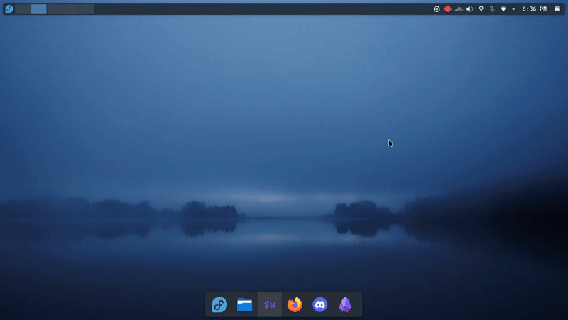

# ⚔️ SL — The SYSTEM

> _“Arise, Player.”_  
> A CLI-based personal progression system inspired by **Solo Leveling**.
> **You define your daily quests**, and the SYSTEM keeps you on track — right from your terminal.

---

## 🧭 Overview

**SL** is a lightweight command-line program that helps you build consistent habits and level up in real life.
No browser, no accounts — just a self-hosted **manager** that lives on your machine, keeps track of your goals, and **reminds** you to complete them.

## 📸 Preview



_A notification appearing on the desktop after a task is due._

---

## 🚀 Features

- 📝 Add, list, and complete tasks from the terminal
- 🔔 Desktop notifications (Linux & Windows)
- ⏰ Background reminder loop for incomplete tasks
- 💾 Local JSON storage — no cloud, no tracking

---

## 📦 Setup

### Requirements

- Linux or Windows
- Python ≥ 3.10

### Installation

```bash
git clone [https://github.com/sproutcake23/System-SL.git](https://github.com/sproutcake23/System-SL.git)
cd System-SL
python -m venv venv
source venv/bin/activate  # On Windows use: venv\Scripts\activate
pip install .
```

---

## 🎮 Usage

### 1\. Open the System (CLI)

To add, view, or complete your tasks, run the interactive menu:

```bash
python -m src.cli.main
```

### 2\. Enable Reminders

To receive desktop notifications, open a **separate terminal** and run the background listener:

```bash
python -m src.utils.notifications
```

---

## 🤝 Contributing

Want to help improve the System?  
Check out our [Contributing Guide](https://www.google.com/search?q=CONTRIBUTING.md) to learn how to set up the development environment and project structure.
