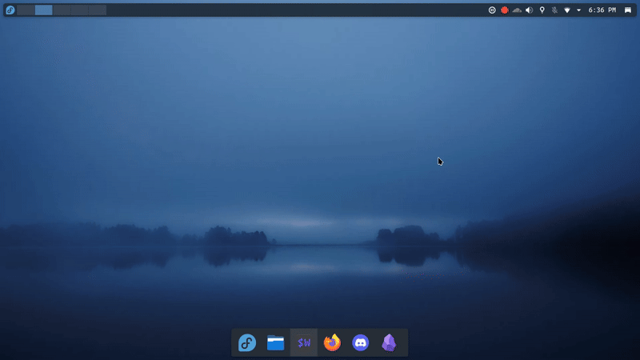

# ⚔️ SL — The SYSTEM

> _“Arise, Player.”_  
> A CLI-based personal progression system inspired by **Solo Leveling**.
> **You define your daily quests**, and the SYSTEM keeps you on track — right from your terminal.

---

## 🧭 Overview

**SL** is a lightweight Linux command-line program that helps you build consistent habits and level up in real life.

## 📸 Preview



_A notification appearing on the desktop after a task is due._

---

## 🚀 Features

- 📝 **Task Management**: Add, list, and complete tasks directly from the terminal.
- 🔔 **Native Notifications**: Desktop alerts styled with a "System" aesthetic
- ⏰ **Background Reminder**: A persistent listener that keeps you on track without draining resources.
- 💾 **Privacy First**: Local JSON storage — no cloud, no accounts, no tracking.

---

## 📦 Setup

### Requirements

- **Linux/Windows**: Fedora (tested)
- **Python**: ≥ 3.10.
- **Environment Manager**: [uv](https://github.com/astral-sh/uv) (recommended).

### Installation

```bash
# Clone the repository
git clone https://github.com/sproutcake23/System-SL.git
cd System-SL

# Sync the environment and dependencies
uv sync

#Activate the .venv
source .venv/bin/activate
```

### Usage

```bash
# Open the CLI menu
uv run system-cli

#Run the notifications loop manually
uv run system-sl
```

### Autostart using systemd(linux only)

1. Create the service file

```bash
nano ~/.config/systemd/user/system-sl.service
```

2. Paste the following(replace with your actual file paths)

```bash
[Unit]
Description=System-SL Notification Listener
After=network.target

[Service]
Type=simple

WorkingDirectory=/your/working/dir/System-SL

ExecStart=/your/working/dir/System-SL/.venv/bin/python -m utils.notifications
Restart=on-failure
RestartSec=5

[Install]
WantedBy=default.target
```

3. Enable and start the service

```bash
systemctl --user daemon-reload
systemctl --user enable system-sl.service
systemctl --user start system-sl.service
```

## 🤝 Contributing

Want to help improve the System?  
Check out our [Contributing Guide](CONTRIBUTING.md) to learn how to set up the development environment and project structure.
