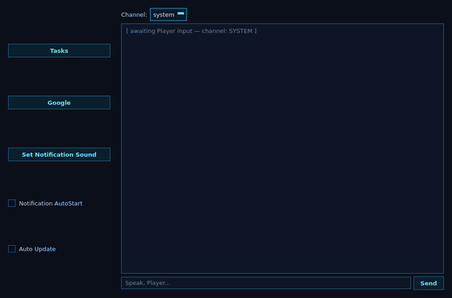
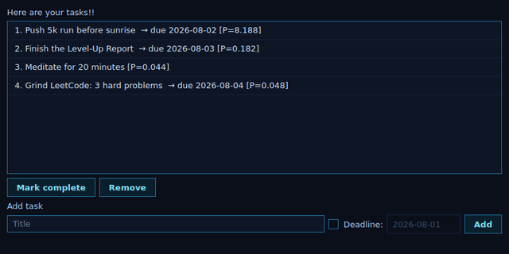
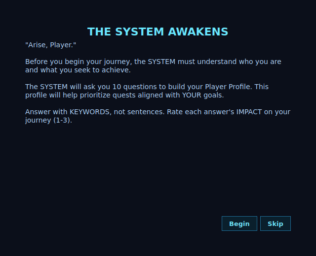
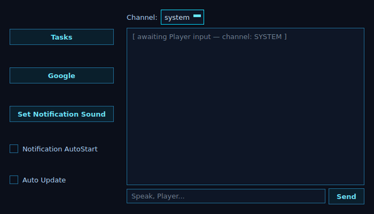
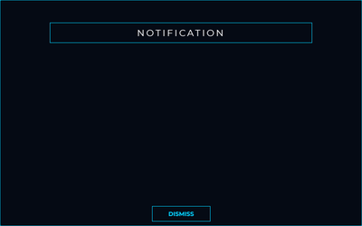

# SL — The SYSTEM

> _"Arise, Player."_

SL is a personal progression system inspired by Solo Leveling. You define your daily quests, and the SYSTEM keeps you on track — on your desktop or from the terminal.

## Preview

<table>
  <tr>
    <td>
      <p align="center"></p>
      <p align="center"><em>Main menu</em></p>
    </td>
    <td>
      <p align="center"></p>
      <p align="center"><em>Task manager</em></p>
    </td>
    <td>
      <p align="center"></p>
      <p align="center"><em>Onboarding wizard</em></p>
    </td>
  </tr>
  <tr>
    <td>
      <p align="center"></p>
      <p align="center"><em>Chat</em></p>
    </td>
    <td>
      <p align="center"></p>
      <p align="center"><em>System notification</em></p>
    </td>
  </tr>
</table>

## Features

- **Persona Builder** — A 10-step onboarding process that builds your Player Profile from your real-world ambitions.
- **Task Management** — Add, complete, and reorder quests with deadlines and categories.
- **Google Calendar Sync** — Import tasks from Google Calendar and Tasks.
- **Native Notifications** — Desktop alerts styled like the System, with custom notification sounds.
- **AI Chatbot** — Talk to the System, an AI mentor powered by Gemini with task-aware tools, plus a friendly companion persona.
- **Priority Engine** — Context-aware scoring (PRESSURE / GROWTH / RECOVERY) of what to work on next.
- **NLP Vectorizer** — spaCy-powered persona vectors built from your responses and task history, with temporal decay.
- **Background Reminder** — A persistent hourly notifier that keeps you on track.
- **Cross-Platform Autostart** — Register the notifier on Linux, Windows, or macOS.

## Quick Start

Requirements: Python >= 3.11 and < 3.14, and [uv](https://github.com/astral-sh/uv).

```bash
git clone https://github.com/sproutcake23/System-SL.git
cd System-SL
uv sync
```

Launch the desktop app:

```bash
uv run system-sl
```

Run the background notifier:

```bash
uv run system-sl --bg
```

Build a standalone executable:

```bash
uv run build-sl
```

## Documentation

Full documentation lives in the wiki:

- [Installation](https://github.com/sproutcake23/System-SL/wiki/Installation)
- [Features](https://github.com/sproutcake23/System-SL/wiki/Features)
- [Google Calendar Sync](https://github.com/sproutcake23/System-SL/wiki/Google-Calendar-Sync)
- [CLI Usage](https://github.com/sproutcake23/System-SL/wiki/CLI-Usage)
- [Background Service](https://github.com/sproutcake23/System-SL/wiki/Background-Service)
- [Building and Releasing](https://github.com/sproutcake23/System-SL/wiki/Building-and-Releasing)

## Contributing

See [CONTRIBUTING.md](CONTRIBUTING.md).
